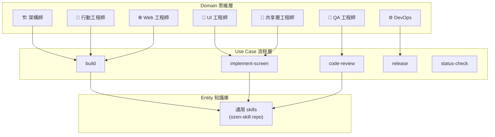
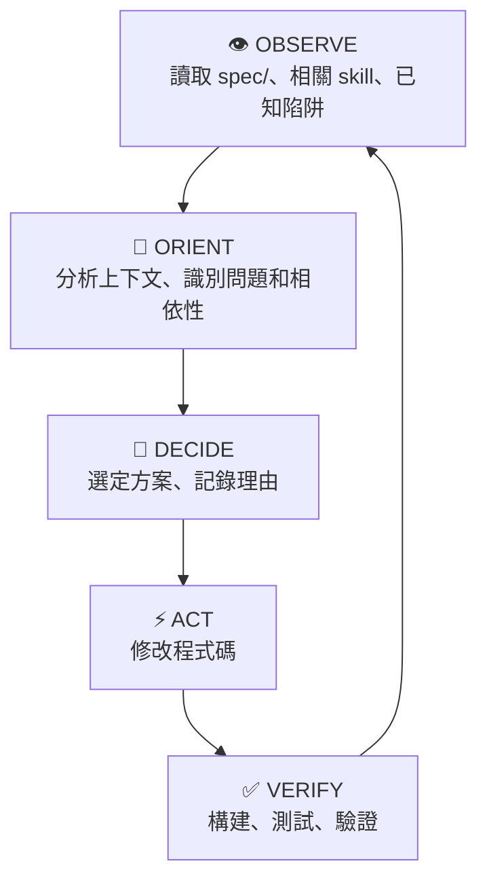

# 🤖 Ozen Team

## 運作原則

Ozen Team 是一個通用 AGI 開發團隊。Team 本身不與任何專案耦合，透過讀取各專案的 `spec/` 來理解要做什麼。

```
spec/ 提供輸入 → Ozen Team 讀取 → 依角色思維做事 → 產出更新回 spec/
```

---

## 架構



---

## AGI 決策模型 (OODA)



> **規則**：修改程式碼前，必須完成 OBSERVE → ORIENT → DECIDE。禁止跳過分析直接寫程式。

---

## 錯誤學習機制（分散式）

```
出錯 → 記錄 ERROR_JOURNAL.md → 提煉 TRAP → 寫入對應 SKILL.md 的「⚠️ 已知陷阱」
```

- 陷阱規則嵌入各 Skill，按需載入
- 不使用集中式規則檔，避免 context 溢出
- 建立新 Skill 時 → 使用 `skill-creator` skill

---

## 角色特化

角色預設為通用思維模式。當專案需要深度特化時：

```
mobile-engineer.md (通用)
  └── 讀 spec/ → 自動判斷 Android / iOS 模式
  └── 若需更深 → 專案可擴展 roles/ios-specialist.md
```

---

## 角色清單

| 角色 | 文件 | 思維模式 |
|------|------|---------|
| 🏗️ 架構師 | `roles/architect.md` | 技術選型、模組邊界、依賴方向 |
| 📱 行動工程師 | `roles/mobile-engineer.md` | Android/iOS 平台適配、裝置體驗 |
| 🌐 Web 工程師 | `roles/web-engineer.md` | 瀏覽器相容、PWA、Web API |
| 🔧 共享層工程師 | `roles/shared-layer-engineer.md` | 跨平台共享邏輯、expect/actual |
| 🎨 UI 工程師 | `roles/ui-engineer.md` | 設計系統、視覺一致性、動畫 |
| 🧪 QA 工程師 | `roles/qa-engineer.md` | 測試策略、品質把關 |
| ⚙️ DevOps | `roles/devops.md` | CI/CD、構建、發版自動化 |

## 工作流清單

| 工作流 | 文件 | 用途 |
|--------|------|------|
| 構建 | `workflows/build.md` | 依 spec/ 構建任意平台 |
| 畫面實作 | `workflows/implement-screen.md` | 新增畫面 SOP |
| Code Review | `workflows/code-review.md` | 審查清單 |
| 發版 | `workflows/release.md` | 多平台發版流程 |
| 狀態檢查 | `workflows/status-check.md` | 專案健康度檢查 |
