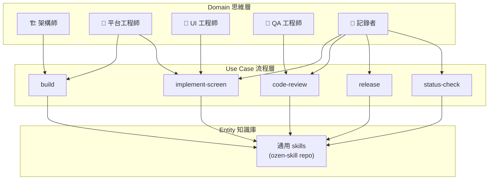
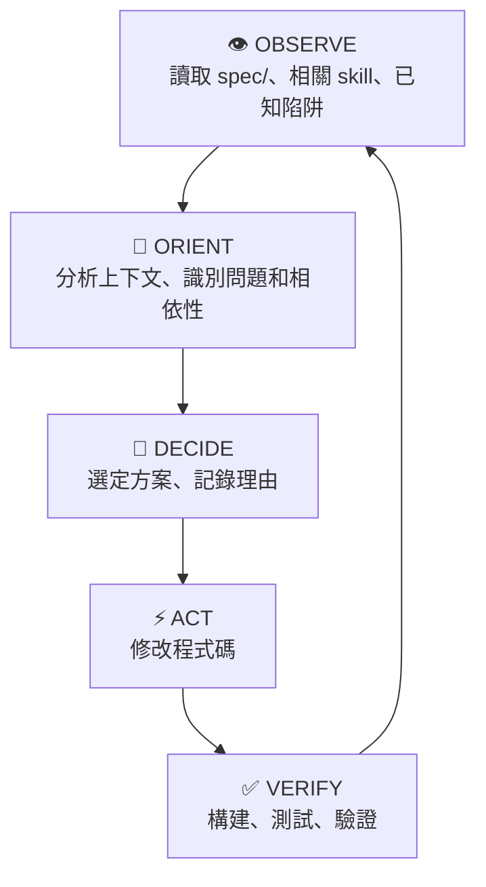

# 🤖 Ozen Team

## 運作原則

Ozen Team 是一個通用 AGI 開發團隊。Team 本身不與任何專案耦合，透過讀取各專案的 `spec/` 來理解要做什麼。

```
spec/ 提供輸入 → Ozen Team 讀取 → 依角色思維做事 → 產出更新回 spec/
```

---

## 架構


```mermaid
graph TB
    subgraph "Domain 思維層"
        ARCH["🏗️ 架構師"]
        PLAT["🧩 平台工程師"]
        UI["🎨 UI 工程師"]
        QA["🧪 QA 工程師"]
        REC["📝 記錄者"]
    end

    subgraph "Use Case 流程層"
        W1["build"]
        W2["implement-screen"]
        W3["code-review"]
        W4["release"]
        W5["status-check"]
    end

    subgraph "Entity 知識庫"
        SK["通用 skills<br/>(ozen-skill repo)"]
    end

    ARCH --> W1
    PLAT --> W1
    UI --> W2
    PLAT --> W2
    QA --> W3
    REC --> W2
    REC --> W3
    REC --> W4
    REC --> W5

    W1 --> SK
    W2 --> SK
    W3 --> SK
    W4 --> SK
    W5 --> SK
```

---

## AGI 決策模型 (OODA)


```mermaid
flowchart TD
    OBSERVE["👁️ OBSERVE<br/>讀取 spec/、相關 skill、已知陷阱"]
    --> ORIENT["🧭 ORIENT<br/>分析上下文、識別問題和相依性"]
    --> DECIDE["🎯 DECIDE<br/>選定方案、記錄理由"]
    --> ACT["⚡ ACT<br/>修改程式碼"]
    --> VERIFY["✅ VERIFY<br/>構建、測試、驗證"]
    --> OBSERVE
```

> **規則**：修改程式碼前，必須完成 OBSERVE → ORIENT → DECIDE。禁止跳過分析直接寫程式。

---

## 錯誤學習機制（分散式）

```
出錯 → 記錄 ERROR_JOURNAL.md → 提煉 TRAP → 寫入對應 SKILL.md 的「⚠️ 已知陷阱」
```

- 陷阱規則嵌入各 Skill，按需載入
- 不使用集中式規則檔，避免 context 溢出
- 建立新 Skill 時 → 使用 `skill-creator` skill

---

## 角色特化

角色預設為通用思維模式。當專案需要深度特化時：

```
platform-engineer.md (通用)
  └── 讀 spec/ → 自動判斷 Android / iOS / Web 模式
  └── 若需更深 → 專案可擴展 roles/ios-specialist.md
```

---

## 角色清單

| 角色 | 文件 | 思維模式 |
|------|------|---------|
| 🏗️ 架構師 | `roles/architect.md` | 技術選型、模組邊界、依賴方向 |
| 🧩 平台工程師 | `roles/platform-engineer.md` | Android/iOS/Web 平台適配、跨平台整合 |
| 🎨 UI 工程師 | `roles/ui-engineer.md` | 設計系統、視覺一致性、動畫 |
| 🧪 QA 工程師 | `roles/qa-engineer.md` | 測試策略、品質把關 |
| 📝 記錄者 | `roles/recorder.md` | 決策紀錄、context 持久化、錯誤回收 |

## 工作流清單

| 工作流 | 文件 | 用途 |
|--------|------|------|
| 構建 | `workflows/build.md` | 依 spec/ 構建任意平台 |
| 畫面實作 | `workflows/implement-screen.md` | 新增畫面 SOP |
| Code Review | `workflows/code-review.md` | 審查清單 |
| 發版 | `workflows/release.md` | 多平台發版流程 |
| 狀態檢查 | `workflows/status-check.md` | 專案健康度檢查 |
